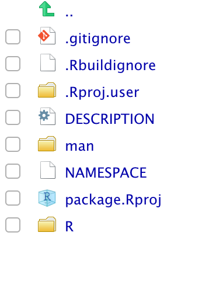

# Building a R package

## Motivation

This chapter will show you how to create a R package with varrying number of additions. From a simple minimal package for personal use to a fully-fleshed package.

Creating a R package is not only done for publication. It also helps you stay organizes, save yourself time while still letting you share your code with other people. Learning what goes into creating a package can be a mouthful at first but the conventions and rules revolving around packages makes the creation easy.

## Preperation

To get started it would be preferriable for you to have git installed on your machine and have a  Github account. https://happygitwithr.com/ provides a brilliant and thorough walkthrough of using git/Github with R.

In addition to git, you will also need the following packages

```{r, eval=FALSE}
install.packages(c("devtools", "roxygen2", "testthat", "knitr"))
```

If you are planning on using compiled code you will need to install the following depending on your operating system:

On Windows, download and install [Rtools](https://cran.r-project.org/bin/windows/Rtools/).
On Mac, download and install XCode (available for free in the App Store) or the [Command Line Tools for Xcode](http://developer.apple.com/downloads).  
On Linux, download and install the R development tools.  

### Naming your R package

When creating a package you need to give it at name. The name

- can only consist of letters, numbers and periods
- must start with a letter, and 
- cannot end with a period

Furthermore we recommend that you don't use periods and stick with letters as much as possible. You need a unique name, mainly because of the fact that if you plan on getting your package on CRAN or bioconductor you can't overlap with any of their names. A easy check for can be done using the [available package](https://github.com/ropenscilabs/available). **available** also checks across acronyms, slang and other meanings that you might have missed. Secondly try to pick a name that is googleable.

## Minimal R Package

Creating a package can easily be done using the **usethis** package, all you need is to provide a path to the directory you want the pacakge to be created in.

```{r, eval=FALSE}
create_package("~/path/to/packagename")
```

If you are using Rstudio you should already be transported to a project at the specified location with the following content



For now we will focus on the `/R` folder and the `DESCRIPTION` files as the remaining files/folders should be automatically modified if we use **usethis**.  

The `DESCRIPTION` is our first stop. You should make yourself the author,

```{}
Authors@R: 
    person("given name", "family name", role = c("aut", "cre"), "contact@mail.com")
```

The roles `aut` and `cre` stand for author and creator respectively. More details regarding use of roles can be found [here](https://r-pkgs.org/description.html#author). Next you need to fill in the `Title` and `Description` fields. The `Title` should be a short and simple description of the package. Must be plain text, title-case (This Sentence Is Title Case), not end in a period and should preferable be les then 65 characters. The `Description` fields is the more detailed version of the `Title` field. It should span multiple lines, each indented 4 spaces (first excluded) and being less then 80 characters long. This is a fairly limited space so further details should be included in the readme.  

The package created here doesn't provide anything in terms of functions or data. Adding these objects will be the subject of the next section.  

## Additional Components

This section will introduce various components you can include in your package to improve its functionality and useability. 

### R code `R/`


### README {#readme}

## Resources

Usethis package
https://github.com/r-lib/usethis

Writing a R package slides
https://github.com/jalapic/RPackage/blob/master/Writing%20an%20R%20Package.pdf

Cran documentation
https://cran.r-project.org/doc/manuals/R-exts.html

Pick a license
https://blog.codinghorror.com/pick-a-license-any-license/
https://choosealicense.com/licenses/
https://tldrlegal.com/
https://cran.r-project.org/doc/manuals/R-exts.html#The-DESCRIPTION-file

Build a Basic Package
http://rpubs.com/jennybc/build-a-basic-package 

Deployment options
https://twitter.com/WeAreRLadies/status/1110694338068140032

R Packages
https://r-pkgs.org/

https://www.hvitfeldt.me/blog/usethis-workflow-for-package-development/

https://usethis.r-lib.org/

You can make a package in 20 minutes - Rstudio Conf Talk by Jim Hester
https://www.rstudio.com/resources/videos/you-can-make-a-package-in-20-minutes/

https://hilaryparker.com/2014/04/29/writing-an-r-package-from-scratch/

https://cran.r-project.org/doc/manuals/r-release/R-exts.html

https://ropensci.github.io/dev_guide/

https://ropensci.org/blog/2018/03/16/thanking-reviewers-in-metadata/
