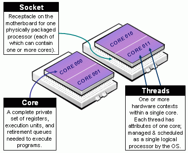

# Parallel computing

Before starting, be advice that this chapter is in continuous work-in-progress mode, which translates in potential changes in the ordering of the sections, availability of contents, etc.

## Introduction

In this chapter we will introduce the reader to parallel computing using R. In particular, we will take a general overview on what is parallel computing, how can it benefit us, and how can it be used in R.

The rest of this chapter develops under the assumption that the reader has some level of knowledge about R fundamentals (types of objects, functions, etc.).


## What is parallel computing, anyway? 

In very simple terms, parallel computing is all about making things running faster. More concrete, while there are plenty ways of accelerating calculations, parallel computing is all about doing multiple things simulateneously.

Sequential computing, on the other hand, is what we usually see in R. When we make a call to a function, most of the time R is doing calculations using a single processor. While this may not be a problem if your call takes just a couple of seconds, it may be critical if, for example, the program needs to make a significant number of such calls, say 1,000, in order to be completed.

While not a general rule, most of the time computationally intensive programs can be splitted in such a way that its components can be executed in a isolated way, this is, without rellying in the other parts to be completed.

For example, suppose that you have a function that takes a number and multiplies it by 2, let's call it `f`:

```{r 03-parallel-times2}
f <- function(n) n*2
```

In R, this simple function can be applied seemesly to a vector, for example:

```{r 03-parallel-times2-applied}
x <- 1:4
f(x)
```

If we were able to see how calculations are taking place in R, we could represent this in the following way:

{width="600px"}

Now, in a parallel computing setting, the same function can be applied simulatenously to multiple elements of `x`, as in the following figure, where the number of cores matches the number of elements/tasks that need to be processed:

{width="600px"}

In principle, this implementation of the function `f` should take 1/4 of what the original version takes to be applied to `x`. As the number of function calls increases, or in other words, as the complexity in terms of computational time increases, it makes sense to start thinking about parallel computing. This takes us to the next section.


## When is it a good idea?

Parallel computing sounds great, but is it always a good idea to try to **parallelize** your program? The answer is no.

A lot of times we feel pushed towards writing the code as efficient as possible. Moreover, this is a known problem among software developers, see for example this hilarious reply on [Stackoverflow](https://www.stackoverflow.com) regarding "bets comment in source code"[^total_hours_wasted]:

[^total_hours_wasted]: Read the original post (now closed) [here](https://stackoverflow.com/questions/184618/what-is-the-best-comment-in-source-code-you-have-ever-encountered). 

```
// 
// Dear maintainer:
// 
// Once you are done trying to 'optimize' this routine,
// and have realized what a terrible mistake that was,
// please increment the following counter as a warning
// to the next guy:
// 
// total_hours_wasted_here = 42
// 
```

While optimizing a program may be important in some cases, time constraints and redability may be more important in relative terms. As a rule of thumb, you will only want to optimize your code if by doing so the potential speed gains are worthwhile, for example, reducing computation speed to half of the original time in a algorithm that takes more than just a few seconds. Other examples include:

Good idea when:

*   You are writing a log-likelihood Function that you need to maximize. Solvers take, for example, at least 5 calls to the objective function so it makes sense to speed up the call.

*   Even more relevant than a simple optimization, if the function needs to be called thousands of times like in a MCMC algorithm, then it definetly makes sense to improve speed.

*   You are processing chunks of data in which each requires a significant amount of time to be processed.

Bad idea when:

*   The section of the program that you want to speed up already takes a relatively small time to be completed, for example, a few seconds or a fraction of a second.

*   The section of the program you are trying to optimize is not the the actual bottle neck of the program[^bottleneck]

[^bottleneck]: For more about how to identify code bottlenecks, take a look at the Profilinf section of this book [here](#profile-benchmark).

If your computational problem is reasonable enought to think about code optimization, and furthermore, implementing parallel computing, then the following diagram should be a useful guide to follow:


If your problem reached the part in which it can be parallelized but there are no tools around for you to use, keep reading, otherwise move to the next chapter and don't come back until you have a problem worthy enough to be dealt with parallel computing... just kidding.

## Fundamentals

Before jumping into HPC with R, let's take a look at some concepts that are fundamental for the rest of the chapter.

### Types of parallelisms

A nice way to look at types of computation is through Flynn's taxonomy:

](figure/flynnsTaxonomy.png)

### What you need to know about Hardware

One important thing to know is how many resources we have, and resources can be very different accross systems. In general, we can talk about a computer's processing unit, CPU, as a collection of cores which are grouped/arranged in sockets. More over, modern CPUs such as those built by intel have what they call multithreaded technology, which in raw terms means a single physical core behaving as multiple ones. The following figure shows a nice illustration of this:




Now, how many cores does your computer has, the parallel package can tell you that:

```{r 03-how-many-cores}
parallel::detectCores()
```

### HPC in R

Loosely, from R's perspective, we can think of HPC in terms of two, maybe three things:

1.  Big data: How to work with data that doesn't fit your computer

2.  Parallel computing: How to take advantage of multiple core systems

3.  Compiled code: Write your own low-level code (if R doesn't has it yet...)

In the case of Big Data, some solutions include:

*   Buy a bigger computer/RAM memory (not the best solution!)
    
*   Use out-of-memory storage, i.e., don't load all your data in the RAM. e.g.
    The [bigmemory](https://CRAN.R-project.org/package=bigmemory),
    [data.table](https://CRAN.R-project.org/package=data.table),
    [HadoopStreaming](https://CRAN.R-project.org/package=HadoopStreaming) R packages

*   Store it more efficiently, e.g.: Sparse Matrices (take a look at the `dgCMatrix` objects
    from the [Matrix](https://CRAN.R-project.org/package=Matrix) R package)
    

## Parallel computing in R

As mentioned earlier, R was not designed to work with parallel computing out-of-the-box. While there are some ways to go around this such as:

*   Obtaining the R version owned by Microsoft ([Microsoft R Open](https://mran.microsoft.com/)), which has some features, and in particular, linear algebra routines compiled in parallel;

*   Compiling R with BLAS allowing for parallel computing (a couple of examples [here](https://www.r-bloggers.com/why-is-r-slow-some-explanations-and-mklopenblas-setup-to-try-to-fix-this/) and [here](https://www.r-bloggers.com/compile-r-and-openblas-from-source-guide/));

*   Getting the opensource version pqR ([pretty quick R](http://www.pqr-project.org/), which at the writing of this has a stable release published on February 19th, 2019);

When it comes to use "normal" R, there are several alternatives (just take a look at the [High-Performance Computing Task View](https://cran.r-project.org/web/views/HighPerformanceComputing.html)). Here we will focus on the following R-packages/tools for explicit parallelism:


1.  **parallel**: R package that provides '[s]upport for parallel computation, including random-number generation'.

2.  RcppArmadillo + OpenMP
    
    *   **RcppArmadillo**: 'Armadillo is a C++ linear algebra library, aiming towards a good balance between speed and ease of use.' '[RcppArmadillo] brings the power of Armadillo to R.'
        
    *  **OpenMP**: 'Open Multi-Processing is an application programming interface (API) that supports multi-platform shared memory multiprocessing programming in C, C++, and Fortran, on most platforms, processor architectures and operating systems, including Solaris, AIX, HP-UX, Linux, macOS, and Windows.' ([Wiki](https://en.wikipedia.org/wiki/OpenMP))

Implicit parallelism, on the other hand, are out-of-the-box tools that allow the programmer not to worry about parallelization, e.g. such as [**gpuR**](https://cran.r-project.org/package=gpuR) for Matrix manipulation using GPU.

### The parallel package

1.  Create a cluster:
    
    a.  PSOCK Cluster: `makePSOCKCluster`: Creates brand new R Sessions (so nothing is inherited from the master), even in other computers!
        
    b.  Fork Cluster: `makeForkCluster`: Using OS [Forking](https://en.wikipedia.org/wiki/Fork_(system_call)), copies the current R session locally (so everything is inherited from the master up to that point). Not available on Windows.
    
    c.  Other: `makeCluster` passed to **snow**
    
2.  Copy/prepare each R session:

    a.  Copy objects with `clusterExport`

    b.  Pass expressions with `clusterEvalQ`

    c.  Set a seed
    

3.  Do your call:

    a.  `mclapply`, `mcmapply` if you are using **Fork**

    b.  `parApply`, `parLapply`, etc. if you are using **PSOCK**

    
4.  Stop the cluster with `clusterStop`
    
### parallel example 1: Parallel RNG


```r
# 1. CREATING A CLUSTER
library(parallel)
cl <- makePSOCKcluster(2)    

# 2. PREPARING THE CLUSTER
clusterSetRNGStream(cl, 123) # Equivalent to `set.seed(123)`

# 3. DO YOUR CALL
ans <- parSapply(cl, 1:2, function(x) runif(1e3))
(ans0 <- var(ans))
```

```
#               [,1]          [,2]
# [1,]  0.0861888293 -0.0001633431
# [2,] -0.0001633431  0.0853841838
```

```r
# I want to get the same!
clusterSetRNGStream(cl, 123)
ans1 <- var(parSapply(cl, 1:2, function(x) runif(1e3)))

ans0 - ans1 # A matrix of zeros
```

```
#      [,1] [,2]
# [1,]    0    0
# [2,]    0    0
```

```r
# 4. STOP THE CLUSTER
stopCluster(cl)
```

In the case of `makeForkCluster`


```r
# 1. CREATING A CLUSTER
library(parallel)

# The fork cluster will copy the -nsims- object
nsims <- 1e3
cl    <- makeForkCluster(2)    

# 2. PREPARING THE CLUSTER
RNGkind("L'Ecuyer-CMRG")
set.seed(123) 

# 3. DO YOUR CALL
ans <- do.call(cbind, mclapply(1:2, function(x) {
  runif(nsims) # Look! we use the nsims object!
               # This would have fail in makePSOCKCluster
               # if we didn't copy -nsims- first.
  }))
(ans0 <- var(ans))
```

```
#            [,1]       [,2]
# [1,] 0.08538418 0.00239079
# [2,] 0.00239079 0.08114219
```

```r
# Same sequence with same seed
set.seed(123) 
ans1 <- var(do.call(cbind, mclapply(1:2, function(x) runif(nsims))))

ans0 - ans1 # A matrix of zeros
```

```
#      [,1] [,2]
# [1,]    0    0
# [2,]    0    0
```

```r
# 4. STOP THE CLUSTER
stopCluster(cl)
```

## parallel example 2: Simulating $\pi$


*   We know that $\pi = \frac{A}{r^2}$. We approximate it by randomly adding points $x$ to a square of size 2 centered at the origin.

*   So, we approximate $\pi$ as $\Pr\{\|x\| \leq 1\}\times 2^2$

The R code to do this


```r
pisim <- function(i, nsim) {  # Notice we don't use the -i-
  # Random points
  ans  <- matrix(runif(nsim*2), ncol=2)
  
  # Distance to the origin
  ans  <- sqrt(rowSums(ans^2))
  
  # Estimated pi
  (sum(ans <= 1)*4)/nsim
}
```

```r
# Setup
cl <- makePSOCKcluster(10)
clusterSetRNGStream(cl, 123)

# Number of simulations we want each time to run
nsim <- 1e5

# We need to make -nsim- and -pisim- available to the
# cluster
clusterExport(cl, c("nsim", "pisim"))

# Benchmarking: parSapply and sapply will run this simulation
# a hundred times each, so at the end we have 1e5*100 points
# to approximate pi
rbenchmark::benchmark(
  parallel = parSapply(cl, 1:100, pisim, nsim=nsim),
  serial   = sapply(1:100, pisim, nsim=nsim), replications = 1
)[,1:4]
```

```
#       test replications elapsed relative
# 1 parallel            1   0.302    1.000
# 2   serial            1   1.556    5.152
```


```r
ans_par <- parSapply(cl, 1:100, pisim, nsim=nsim)
ans_ser <- sapply(1:100, pisim, nsim=nsim)
stopCluster(cl)
```


```
#      par      ser        R 
# 3.141561 3.141247 3.141593
```


### Speedup things with Rcpp + OpenMP

