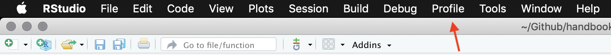
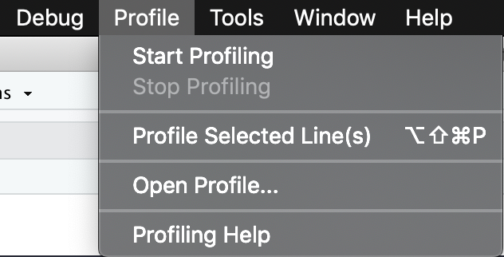
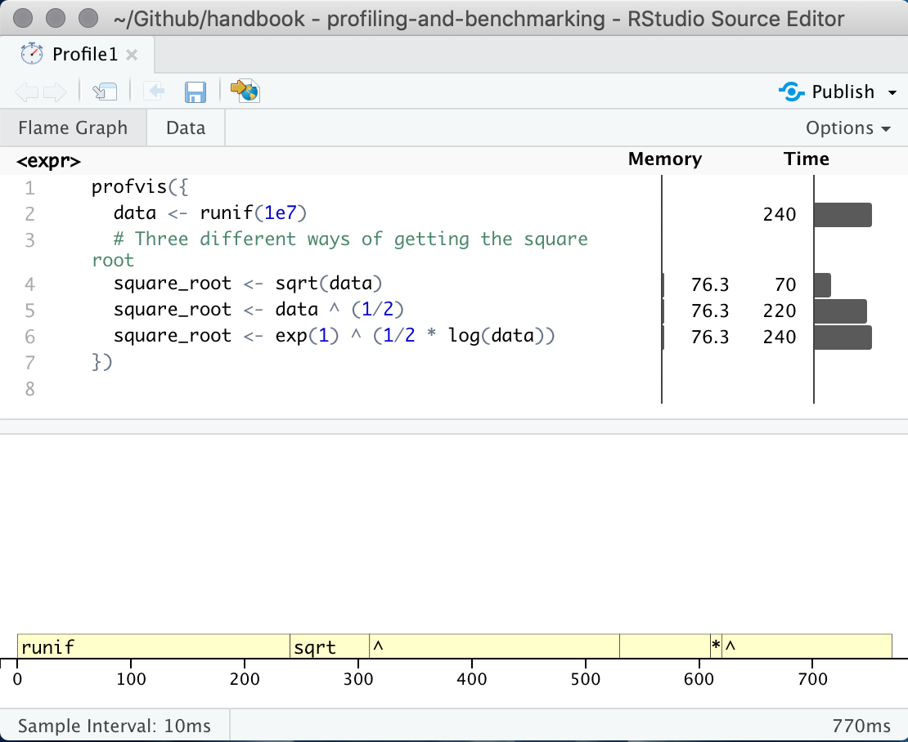
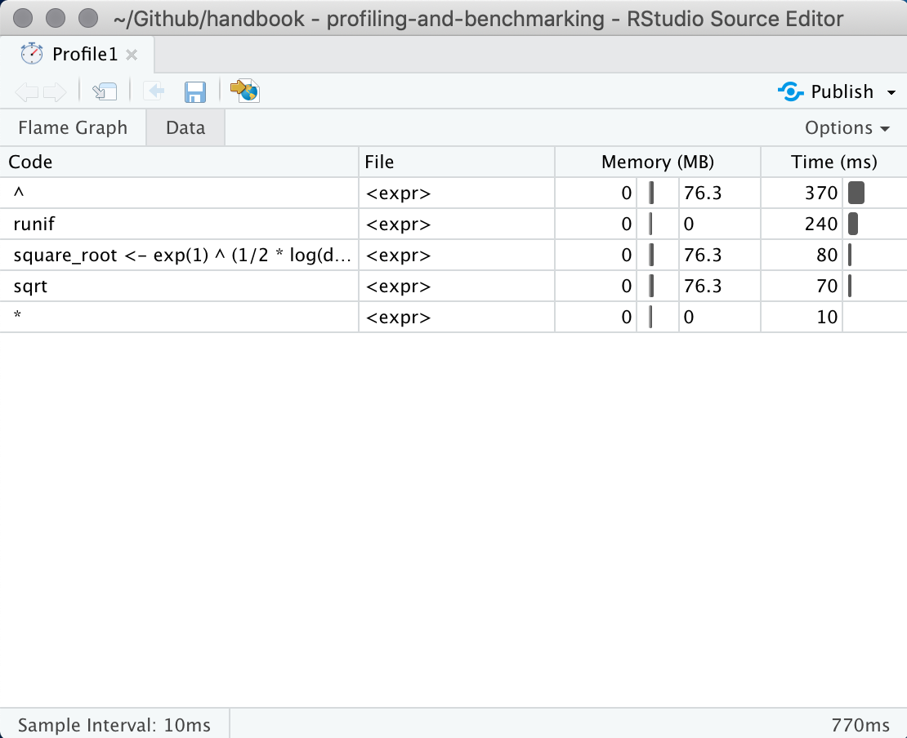

# Profiling and benchmarking {#profile-benchmark}

## Introduction

This chapter will introduce the the concepts of profiling and benchmarking. These concepts are universal withing programming and this chapter will focus on its practical implementation and usage in the R programming language.

The overall goal of these techniques is to meassure the performance of the code you have written. This is not a measure of correctness, it is a measure of speed.

## Profiling

Profiling is the act of meassuring the runtime of each line of code you have written. Knowing where the majority of time is being spend in your code (also called a "bottleneck") is benificial as it is a good indication of where you should spend your time optimizing.  

we will use the the [profvis](https://rstudio.github.io/profvis/) package to do profiling. It have a couple of different ways of interacting. In the first one you load the **profvis** package and then you wrap the code you want to profile in `profvis({` and `})`, show below.

```{r, eval=FALSE}
library(profvis)

profvis({
  data <- runif(1e7)
  # Three different ways of getting the square root
  square_root <- sqrt(data)
  square_root <- data ^ (1/2)
  square_root <- exp(1) ^ (1/2 * log(data))
})
```

If you are using the Rstudio IDE then you can access the profiling tool from the navigation bar

```{r, echo = FALSE, out.width = "100%", fig.cap = "Profile location in Rstudio IDE navigation bar."}

```

Clicking this tab reveals the following actions: "Profile selected line(s)" This option is great if you have a short and compact peice of code that easily can be highlighed and tested. 

```{r, echo = FALSE, out.width = "50%", fig.align='center', fig.cap = "Profiling actions."}

```

Being able to start and stop the profiling is another powerful tool. In addition to being able to profile code from different areas, you are also able to stop profiling before the code is done executing, which you aren't able to in the previous 2 methods. This is useful if you want to profile a snapshot of a long-running simulation as it can have very consistant behaviour since it is running the same thing millions of time.

No matter which of the three way you did your profile you will be presented a framegraph

```{r, echo = FALSE, out.width = "75%", fig.align='center', fig.cap = "profvis output showing source on top and flame graph below."}

```

This interactive panel shows how much time is being spend on each line of code. Another useful view can be found by clicking on the "data" tab at the top. This shows how long time is being spend in each expression.

```{r, echo = FALSE, out.width = "75%", fig.align='center', fig.cap = "profvis data view showcases results by expresion in stead of by line."}

```

### Troubleshooting

Sometimes when you are using **profvis** you will see the error 

```{}
Error in parse_rprof(prof_output, expr_source) : 
  No parsing data available. Maybe your function was too fast?
```

This is because your code ran before profvis was able to detect it. This might feel like good news, but it can make it difficout to profile fast functions that are being run a lot of times. To profile a fast function you simply let it run a lot of times. This can easily be done by putting it inside a for-loop. You change this

```{r, eval=FALSE}
profvis({
  data <- c(3, 7, 2)

  super_fast_function(data)
})
```

to 

```{r, eval=FALSE}
profvis({
  data <- c(3, 7, 2)

  for (i in 1:1000) {
    super_fast_function(data)
  }
})
```

where you increase the number until it is run enough for the profiler to catch it.
